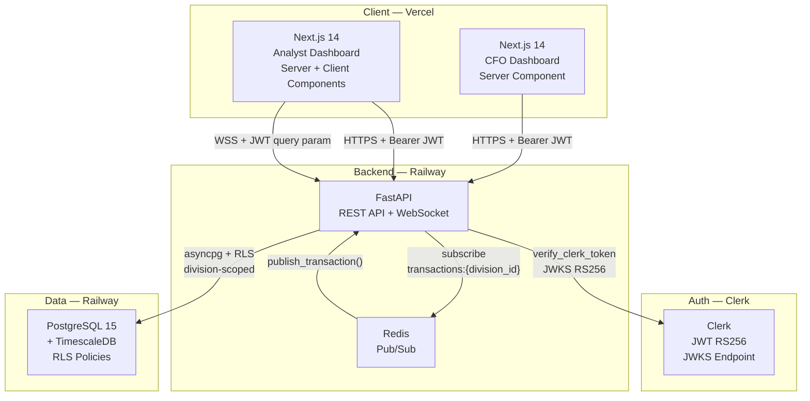

# FinestBank — Real-Time Financial Intelligence Dashboard

A full-stack finance dashboard for CFOs and fintech analysts — org-wide KPI rollups, division drill-downs, and a live transaction feed via WebSockets.


[Live Demo](#) &nbsp;·&nbsp; [API Docs](#)

---

## Overview

FinestBank is a portfolio project demonstrating enterprise-grade financial dashboard architecture. It serves two roles from a single codebase:

- **CFO** — org-wide KPI rollups across all 4 business divisions, trend charts, and interactive filters
- **Analyst** — division-scoped drill-down: transactions, portfolio holdings, and a live WebSocket feed

All data is mock (Python Faker). Row-level security is enforced at the PostgreSQL layer — analysts cannot query outside their assigned division even with direct DB access.

---

## Features

### CFO Dashboard
- Org-wide KPI cards: revenue, net income, active loans, transaction volume
- Revenue trend + net income trend charts (Recharts)
- Division comparison chart — all 4 divisions side by side
- Interactive filters: division selector + date range picker
- `Promise.allSettled` fetches — one failing endpoint never crashes the page

### Analyst Dashboard
- Division-scoped KPI summary (30-day transaction count, volume, portfolio value, active loans)
- Live transaction feed — WebSocket connection with status badge (Connecting / Live / Disconnected)
- Paginated + filterable transaction table (type, category, date range)
- Portfolio holdings table: quantity, unit cost, current price, market value, unrealized P&L, weight %
- Portfolio allocation donut chart by asset type

### Platform
- Role-based routing: CFO sees all divisions; Analyst is scoped to assigned division only
- Row-Level Security enforced at PostgreSQL layer (not just frontend guards)
- Clerk auth: JWT RS256, 15-min expiry + refresh token rotation
- TimescaleDB hypertable for time-series transaction data
- WebSocket auth via JWT query param (browser WS upgrade can't send `Authorization` headers)

---

## Architecture



### Key Design Decisions

| Decision | Rationale |
|----------|-----------|
| RLS at DB layer | Analysts can't query outside their division even with direct DB access |
| Single app, role-based views | JWT claims control rendering — one codebase for both roles |
| JWT via query param for WebSocket | Browser WS API can't send `Authorization` header on WS upgrade |
| `verify_clerk_token` (async JWKS) | Clerk v5 — synchronous JWT decode insufficient; RS256 JWKS required |
| `Promise.allSettled` for CFO fetches | Partial API failure degrades gracefully; remaining cards still render |
| URL-based filter state | Server Components read `searchParams` — no client `useState` needed |
| `case()` aggregation for division comparison | Single JOIN query pivots revenue + net income — avoids N+1 per division |

---

## Tech Stack

| Layer | Technology | Version |
|-------|------------|---------|
| Frontend | Next.js + Tailwind CSS + shadcn/ui | 14.2.3 |
| Charts | Recharts | 2.12.7 |
| Auth | Clerk | 5.1.0 |
| Backend | FastAPI (Python) | 0.111.0 |
| Real-time | WebSockets + Redis pub/sub | redis 5.0.4 |
| ORM | SQLAlchemy (async) + asyncpg | 2.0.30 |
| Database | PostgreSQL 15 + TimescaleDB | — |
| Migrations | Alembic | 1.13.1 |
| Seed Data | Python Faker | 24.11.0 |
| Hosting | Vercel + Railway | — |

---

## Local Setup

### Prerequisites
- Node.js 18+
- Python 3.11+
- Docker + Docker Compose

### 1. Start the database and Redis

```bash
docker compose up -d
```

Starts PostgreSQL + TimescaleDB on port 5432 and Redis on port 6379.

### 2. Backend

```bash
cd backend
pip install -r requirements.txt

# Run migrations
alembic upgrade head

# Seed with mock data (all 4 divisions)
python seed.py

# Start the API server
uvicorn app.main:app --reload
```

API available at `http://localhost:8000` · Swagger docs at `http://localhost:8000/docs`

### 3. Frontend

```bash
cd frontend
npm install
cp .env.local.example .env.local
```

Fill in `.env.local`:

```env
NEXT_PUBLIC_CLERK_PUBLISHABLE_KEY=pk_test_...
CLERK_SECRET_KEY=sk_test_...
NEXT_PUBLIC_CLERK_SIGN_IN_URL=/sign-in
NEXT_PUBLIC_CLERK_SIGN_UP_URL=/sign-up
NEXT_PUBLIC_CLERK_AFTER_SIGN_IN_URL=/dashboard
NEXT_PUBLIC_CLERK_AFTER_SIGN_UP_URL=/dashboard
API_URL=http://localhost:8000
NEXT_PUBLIC_WS_URL=ws://localhost:8000
```

```bash
npm run dev
```

App available at `http://localhost:3000`

### 4. Set up Clerk test users

In the Clerk dashboard, set `publicMetadata` on your test users:

**CFO:**
```json
{ "role": "cfo" }
```

**Analyst:**
```json
{ "role": "analyst", "divisions": ["<division-uuid>"] }
```

Division UUIDs are fixed constants defined in `backend/seed.py`.

---

## Deploy

### Backend → Railway

1. Create a new Railway project
2. Add **PostgreSQL** and **Redis** plugins — Railway injects `DATABASE_URL` and `REDIS_URL` automatically
3. Connect your GitHub repo, set root directory to `backend/`
4. Railway detects the `Dockerfile` and builds automatically
5. Add remaining env vars from `backend/.env.production.example`
6. Run migrations via Railway's shell: `alembic upgrade head && python seed.py`

### Frontend → Vercel

1. Import your GitHub repo in Vercel, set root directory to `frontend/`
2. Vercel detects Next.js via `vercel.json`
3. Add environment variables:

```env
NEXT_PUBLIC_CLERK_PUBLISHABLE_KEY=pk_live_...
CLERK_SECRET_KEY=sk_live_...
NEXT_PUBLIC_CLERK_SIGN_IN_URL=/sign-in
NEXT_PUBLIC_CLERK_SIGN_UP_URL=/sign-up
NEXT_PUBLIC_CLERK_AFTER_SIGN_IN_URL=/dashboard
NEXT_PUBLIC_CLERK_AFTER_SIGN_UP_URL=/dashboard
API_URL=https://your-backend.railway.app
NEXT_PUBLIC_WS_URL=wss://your-backend.railway.app
```

---

## Screenshots

> Screenshots pending live deployment.

```
screenshots/
  cfo-dashboard.png             # CFO KPI cards + trend charts
  cfo-division-comparison.png   # Division comparison chart + date filters
  analyst-transactions.png      # Live feed badge + paginated transaction table
  analyst-portfolio.png         # Holdings table + allocation donut chart
```

---

## Environment Variables

| Variable | Side | Description |
|----------|------|-------------|
| `NEXT_PUBLIC_CLERK_PUBLISHABLE_KEY` | Frontend | Clerk publishable key |
| `CLERK_SECRET_KEY` | Frontend + Backend | Clerk secret key |
| `API_URL` | Frontend (server) | FastAPI base URL — no `NEXT_PUBLIC` prefix (server-only) |
| `NEXT_PUBLIC_WS_URL` | Frontend (client) | WebSocket base URL — `ws://` locally, `wss://` in prod |
| `DATABASE_URL` | Backend | PostgreSQL connection string (asyncpg driver) |
| `REDIS_URL` | Backend | Redis connection string |
| `CLERK_JWKS_URL` | Backend | Clerk JWKS endpoint for RS256 token verification |
| `ALLOWED_ORIGINS` | Backend | CORS origins — set to your Vercel frontend URL |

Full references: `frontend/.env.local.example` · `backend/.env.production.example`
